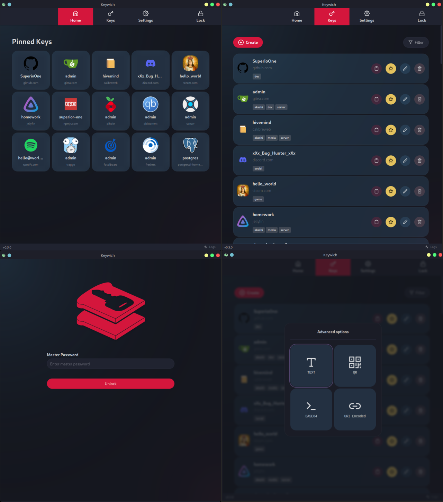

 
 

Keywich is a password generator application built with [Rust](https://www.rust-lang.org/), [SvelteKit](https://kit.svelte.dev/),
[Skeleton UI](https://www.skeleton.dev/) and [Tauri](https://tauri.app/). The app does not store generated passwords.
Instead, it combines parameters such as the username, domain, and master password with a bit of salt and a hashing
algorithm to create reproducible passwords with the specified length and character sets.

 

