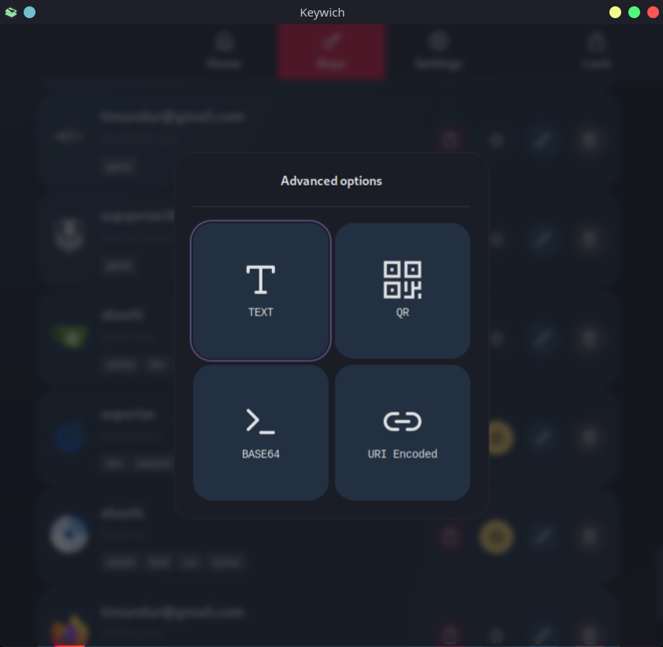

# Managing Keys

At the **Keys** page, you can create and pin your keys or delete the existing keys.

## Creating a key

1. Open **Keys** page and click the **Create** button.
2. Enter domain for the key which can be a non-URL text like `my_server`.
3. Enter the username for the key.
4. Select a charset. If you need a different charset see [charsets](./charsets.md).
5. Choose a password length between `1` and `64`.
6. (Optional) Add tags for filtering.
7. (Optional) Add notes about the key.
8. (Optional) Set a custom revision no.
9. (Optional) Set an icon for key. Supported formats are `jpeg` and `png`.
10. Click to **Confirm** button.

## Quick and Advanced Copy

Generate and copy your password to the clipboard via left-clicking the copy button on the keys page, or right-clicking
the copy button to open `Advanced Copy` menu for additional options like base64 encoding, URI encoded, QR Code and clear
text.

## Pinning a key

Pin frequently used keys to home page by clicking star icon in the key list.

## Updating a key

To update keys, use the pen icon on the keys page. The Update procedure is identical to creating a new key.

> Changing any of the following parameters: `username`, `domain`, `revision no`, `charset` or `target length` will change the output
> password. Only change these values if your intention is to update the password.
>
> You can always generate your old password by using your previous parameters.

## Deleting a key

To delete a key, simply left-click delete button and confirm on the keys page.
