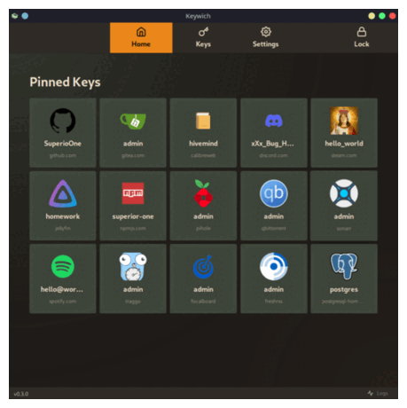

# Settings

You can change the application theme and language via **Settings** page.

Currently, there are 11 color theme mainly from [SkeletonUI](https://www.skeleton.dev/) and 2 language option _(EN,
TR)_.

All configurations are stored in `config.json`, located at:

- `/home/${USER}/.local/share/com.superiorone.keywich/config.json` for Linux.
- `C:\Users\${USER}\AppData\Local\com.superiorone.keywich\config.json` for Windows.

Here's an example of a `config.json` file:

```json
{
  "color_theme": "default",
  "locale": "en",
  "is_light_theme": false
}
```
<br/>

<div align="center">

  

  *Example themes*

</div>
