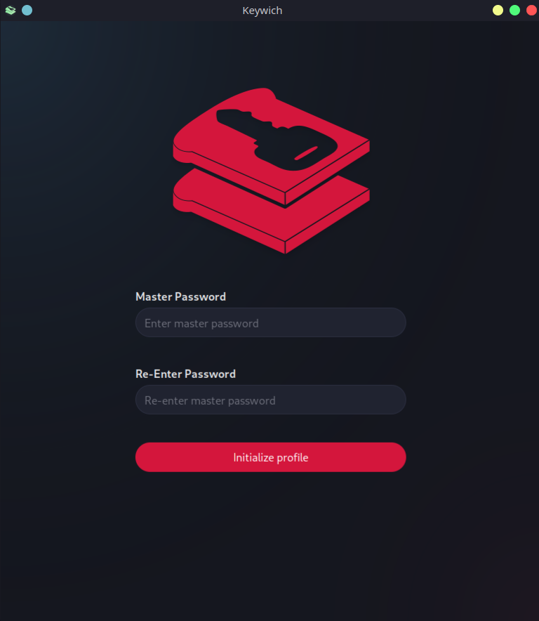

# Setup Profile

Profile database is not initialized when you start the application first time. It asks for your Master Password
which is used for generating your passwords and creating an encryption key for the profile database.

If there is already an existing profile database in the application local data, the application will only ask for master
password for unlocking the database.

> It is important to ensure that your master password is long, random and unique to enhance the security of your
> generated passwords and profile database

